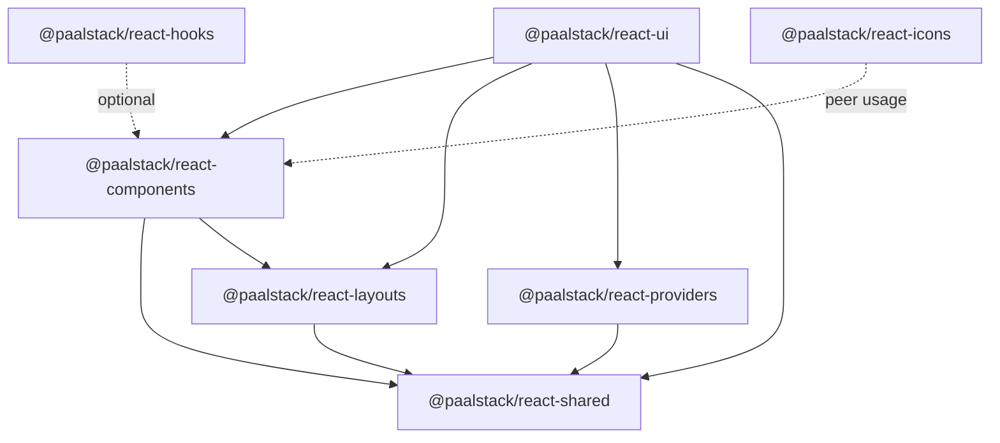

# Architecture

## Package Dependency Graph



## Component Relationships

- **Layouts as foundation:** `Box` wraps most interactive components (Button, Badge).
- **Form stack:** Form → FormField → Field → Input/Select/Checkbox + Label + ErrorMessage.
- **Overlay stack:** Dialog/AlertDialog/Sheet/Drawer share portal, focus trap, scroll lock patterns.
- **Data stack:** Table primitives → DataTable (TanStack) / SimpleTable (lightweight).
- **Menu stack:** DropdownMenu, ContextMenu, Menubar, NavigationMenu share Base UI menu primitives.

## Shared Utilities

| Layer                | Location         | Used By                    |
| -------------------- | ---------------- | -------------------------- |
| cn, forwardRef, Slot | shared/utils     | All components             |
| tailwindBoxVariants  | shared/constants | Box, layouts               |
| createContext        | shared/utils     | Providers, some components |
| Format/HTTP          | shared/lib       | Apps, data hooks           |

## Provider Architecture

```
ThemeProvider
├── ThemeContextProvider (theme state)
└── ToastProvider (sonner)
    └── children

NextThemeProvider → next-themes + ToastProvider
FormatIntlProvider → ICU message formatting context
```

## Context Architecture

| Context    | Hook           | Package                           |
| ---------- | -------------- | --------------------------------- |
| Theme      | useTheme       | providers                         |
| Toast      | useToast       | providers                         |
| FormatIntl | useFormatIntl  | providers                         |
| Direction  | useDirection   | components/Direction              |
| Form       | useFormContext | components/Form (react-hook-form) |

## Theme Architecture

CSS variables in `:root` / `.dark` → Tailwind `@theme` maps to `--color-*` → components use semantic utilities (`bg-primary`, not raw hex).

Build pipeline: `theme.css` + `base.css` → PostCSS/Tailwind → `dist/index.css`.
